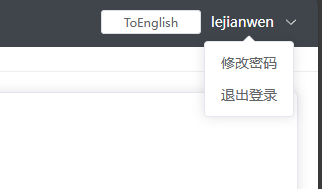
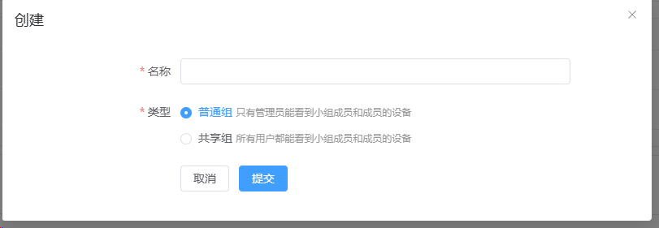

# RustDesk API

[English Doc](README_EN.md)

本项目使用 Go 实现了 RustDesk 的 API，并包含了 Web Admin 和 Web 客户端。RustDesk 是一个远程桌面软件，提供了自托管的解决方案。

 <div align=center>


</div>

# 特性

- PC端API
    - 个人版API
    - 登录
    - 地址簿
    - 群组
    - 授权登录，支持`github`和`google`登录，支持`web后台`授权登录
    - i18n
- Web Admin
    - 用户管理
    - 设备管理
    - 地址簿管理
    - 标签管理
    - 群组管理
    - Oauth 管理
    - 快速使用web client
    - i18n
    - 通过 web client 分享给游客
- Web Client
    - 自动获取API server
    - 自动获取ID服务器和KEY
    - 自动获取地址簿
    - 游客通过临时分享链接直接远程到设备

## 使用前准备

### [Rustdesk](https://github.com/rustdesk/rustdesk)

1. PC客户端使用的是 ***1.3.0***，经测试 ***1.2.6+*** 都可以
2. server端必须指定key，不能用自带的生成的key,否则可能链接不上或者超时

   ```bash
   hbbs -r <relay-server-ip[:port]> -k <key>
   hbbr -k <key>
   ```

   比如

   ```bash
   hbbs -r <relay-server-ip[:port]> -k abc1234567
   hbbr -k abc1234567
   ```

## 功能

### API 服务: 基本实现了PC端基础的接口。支持Personal版本接口，可以通过配置文件`rustdesk.personal`或环境变量`RUSTDESK_API_RUSTDESK_PERSONAL`来控制是否启用

#### 登录

- 添加了`github`和`google`授权登录，需要在后台配置好就可以用了，具体可看后台OAuth配置
- 添加了web后台授权登录,点击后直接登录后台就自动登录客户端了


#### 地址簿


#### 群组,群组分为`共享组`和`普通组`，共享组中所有人都能看到小组成员的设备，普通组只有管理员能看到所有小组成员的设备


### Web Admin:

***使用前后端分离，提供用户友好的管理界面，主要用来管理和展示。前端代码在[rustdesk-api-web](https://github.com/lejianwen/rustdesk-api-web)***

***后台访问地址是`http://<your server>[:port]/_admin/`初次安装管理员为用户名密码为`admin` `admin`，请即时更改密码***

1. 管理员界面
   
2. 普通用户界面
   
   右上角也可以更改密码
   

3. 分组可以自定义，方便管理，暂时支持两种类型: `共享组` 和 `普通组`
   
4. 可以直接打开webclient，方便使用
   
5. Oauth,暂时只支持了`Github`和`Google`, 需要创建一个`OAuth App`，然后配置到后台
   
    - `github oauth app`在`Settings`->`Developer settings`->`OAuth Apps`->`New OAuth App`
      中创建,地址 [https://github.com/settings/developers](https://github.com/settings/developers)
    - `Authorization callback URL`填写`http://<your server[:port]>/api/oauth/callback`
      ，比如`http://127.0.0.1:21114/api/oauth/callback`

### Web Client:

1. 如果已经登录了后台，web client将自动直接登录
2. 如果没登录后台，点击右上角登录即可，api server已经自动配置好了
   
3. 登录后，会自动同步ID服务器和KEY
4. 登录后，会将地址簿自动保存到web client中，方便使用

### 自动化文档: 使用 Swag 生成 API 文档，方便开发者理解和使用 API。

1. 后台文档 `<youer server[:port]>/admin/swagger/index.html`
2. PC端文档 `<youer server[:port]>/swagger/index.html`
   

## 安装与运行

### 相关配置

* 参考`conf/config.yaml`配置文件，修改相关配置。
* 如果`gorm.type`是`sqlite`，则不需要配置mysql相关配置。
* 语言如果不设置默认为`zh-CN`

```yaml
lang: "en"
gin:
  api-addr: "0.0.0.0:21114"
  mode: "release"
  resources-path: 'resources'
  trust-proxy: ""
gorm:
  type: "sqlite"
  max-idle-conns: 10
  max-open-conns: 100
mysql:
  username: "root"
  password: "111111"
  addr: "192.168.1.66:3308"
  dbname: "rustdesk"
rustdesk:
  id-server: "192.168.1.66:21116"
  relay-server: "192.168.1.66:21117"
  api-server: "http://192.168.1.66:21114"
  key: "123456789"
  personal: 1
```

* 环境变量,变量名前缀是RUSTDESK_API，环境变量如果存在将覆盖配置文件中的配置

| 变量名                                 | 说明                                   | 示例                          |
|-------------------------------------|--------------------------------------|-----------------------------|
| TZ                                  | 时区                                   | Asia/Shanghai               |
| RUSTDESK_API_LANG                   | 语言                                   | `en`,`zh-CN`                |
| -----GIN配置-----                     | ----------                           | ----------                  |
| RUSTDESK_API_GIN_TRUST_PROXY        | 信任的代理IP列表，以`,`分割，默认信任所有              | 192.168.1.2,192.168.1.3     |
| -----------GORM配置------------------ | ------------------------------------ | --------------------------- |
| RUSTDESK_API_GORM_TYPE              | 数据库类型sqlite或者mysql，默认sqlite          | sqlite                      |
| RUSTDESK_API_GORM_MAX_IDLE_CONNS    | 数据库最大空闲连接数                           | 10                          |
| RUSTDESK_API_GORM_MAX_OPEN_CONNS    | 数据库最大打开连接数                           | 100                         |
| RUSTDESK_API_RUSTDESK_PERSONAL      | 是否启用个人版API， 1:启用,0:不启用； 默认启用         | 1                           |
| -----MYSQL配置-----                   | ----------                           | ----------                  |
| RUSTDESK_API_MYSQL_USERNAME         | mysql用户名                             | root                        |
| RUSTDESK_API_MYSQL_PASSWORD         | mysql密码                              | 111111                      |
| RUSTDESK_API_MYSQL_ADDR             | mysql地址                              | 192.168.1.66:3306           |
| RUSTDESK_API_MYSQL_DBNAME           | mysql数据库名                            | rustdesk                    |
| -----RUSTDESK配置-----                | ---------------                      | ----------                  |
| RUSTDESK_API_RUSTDESK_ID_SERVER     | Rustdesk的id服务器地址                     | 192.168.1.66:21116          |
| RUSTDESK_API_RUSTDESK_RELAY_SERVER  | Rustdesk的relay服务器地址                  | 192.168.1.66:21117          |
| RUSTDESK_API_RUSTDESK_API_SERVER    | Rustdesk的api服务器地址                    | http://192.168.1.66:21114   |
| RUSTDESK_API_RUSTDESK_KEY           | Rustdesk的key                         | 123456789                   |

### 安装步骤

#### docker运行

1. 直接docker运行,配置可以通过挂载配置文件`/app/conf/config.yaml`来修改,或者通过环境变量覆盖配置文件中的配置

```bash
docker run -d --name rustdesk-api -p 21114:21114 \
-v /data/rustdesk/api:/app/data \
-e TZ=Asia/Shanghai \
-e RUSTDESK_API_RUSTDESK_ID_SERVER=192.168.1.66:21116 \
-e RUSTDESK_API_RUSTDESK_RELAY_SERVER=192.168.1.66:21117 \
-e RUSTDESK_API_RUSTDESK_API_SERVER=http://192.168.1.66:21114 \
-e RUSTDESK_API_RUSTDESK_KEY=123456789 \
lejianwen/rustdesk-api
```

2. 使用`docker compose`

    - 简单示例

   ```docker-compose
   services:
      rustdesk-api:
       container_name: rustdesk-api
       environment:
         - TZ=Asia/Shanghai
         - RUSTDESK_API_RUSTDESK_ID_SERVER=192.168.1.66:21116
         - RUSTDESK_API_RUSTDESK_RELAY_SERVER=192.168.1.66:21117
         - RUSTDESK_API_RUSTDESK_API_SERVER=http://192.168.1.66:21114
         - RUSTDESK_API_RUSTDESK_KEY=123456789
       ports:
         - 21114:21114
       image: lejianwen/rustdesk-api
       volumes:
         - /data/rustdesk/api:/app/data #将数据库挂载出来方便备份
       networks:
         - rustdesk-net
       restart: unless-stopped
   ```

    - 根据rustdesk提供的示例加上自己的rustdesk-api

   ```docker-compose
   networks:
     rustdesk-net:
       external: false
   services:
     hbbs:
       container_name: hbbs
       ports:
         - 21115:21115
         - 21116:21116 # 自定义 hbbs 映射端口
         - 21116:21116/udp # 自定义 hbbs 映射端口
         - 21118:21118 # web client
       image: rustdesk/rustdesk-server
       command: hbbs -r <relay-server-ip[:port]> -k 123456789 # 填入个人域名或 IP + hbbr 暴露端口
       volumes:
         - /data/rustdesk/hbbs:/root # 自定义挂载目录
       networks:
         - rustdesk-net
       depends_on:
         - hbbr
       restart: unless-stopped
       deploy:
         resources:
           limits:
             memory: 64M
     hbbr:
       container_name: hbbr
       ports:
         - 21117:21117 # 自定义 hbbr 映射端口
         - 21119:21119 # web client
       image: rustdesk/rustdesk-server
       command: hbbr -k 123456789
       #command: hbbr
       volumes:
         - /data/rustdesk/hbbr:/root # 自定义挂载目录
       networks:
         - rustdesk-net
       restart: unless-stopped
       deploy:
         resources:
           limits:
             memory: 64M
     rustdesk-api:
       container_name: rustdesk-api
       environment:
         - TZ=Asia/Shanghai
         - RUSTDESK_API_RUSTDESK_ID_SERVER=192.168.1.66:21116
         - RUSTDESK_API_RUSTDESK_RELAY_SERVER=192.168.1.66:21117
         - RUSTDESK_API_RUSTDESK_API_SERVER=http://192.168.1.66:21114
         - RUSTDESK_API_RUSTDESK_KEY=123456789
       ports:
         - 21114:21114
       image: lejianwen/rustdesk-api
       volumes:
         - /data/rustdesk/api:/app/data #将数据库挂载出来方便备份
       networks:
         - rustdesk-net
       restart: unless-stopped
   
   ```

    - 如果使用的是S6的镜像，会需要修改启动脚本，覆盖镜像中的`/etc/s6-overlay/s6-rc.d/hbbr/run`
      和`/etc/s6-overlay/s6-rc.d/hbbr/run`

        1. 创建`hbbr/run`

            ```bash
            #!/command/with-contenv sh
            cd /data
            PARAMS=
            [ "${ENCRYPTED_ONLY}" = "1" ] && PARAMS="-k ${KEY}"
            /usr/bin/hbbr $PARAMS
            ```

        2. 创建`hbbs/run`
            ```bash
            #!/command/with-contenv sh
            sleep 2
            cd /data
            PARAMS=
            [ "${ENCRYPTED_ONLY}" = "1" ] && PARAMS="-k ${KEY}"
            /usr/bin/hbbs -r $RELAY $PARAMS
            ```
        3. 修改`docker-compose.yml`中的`s6`部分

            ```
            networks:
              rustdesk-net:
                external: false
            services:
              rustdesk-server:
                container_name: rustdesk-server
                ports:
                  - 21115:21115
                  - 21116:21116
                  - 21116:21116/udp
                  - 21117:21117
                  - 21118:21118
                  - 21119:21119
                image: rustdesk/rustdesk-server-s6:latest
                environment:
                  - RELAY=192.168.1.66:21117
                  - ENCRYPTED_ONLY=1
                  - KEY=abc123456789
                volumes:
                  - ./data:/data
                  - ./hbbr/run:/etc/s6-overlay/s6-rc.d/hbbr/run
                  - ./hbbs/run:/etc/s6-overlay/s6-rc.d/hbbs/run
                restart: unless-stopped
              rustdesk-api:
                container_name: rustdesk-api
                ports:
                  - 21114:21114
                image: lejianwen/rustdesk-api
                environment:
                  - TZ=Asia/Shanghai
                  - RUSTDESK_API_RUSTDESK_ID_SERVER=192.168.1.66:21116
                  - RUSTDESK_API_RUSTDESK_RELAY_SERVER=192.168.1.66:21117
                  - RUSTDESK_API_RUSTDESK_API_SERVER=http://192.168.1.66:21114
                  - RUSTDESK_API_RUSTDESK_KEY=abc123456789
                volumes:
                  - /data/rustdesk/api:/app/data #将数据库挂载
                networks:
                  - rustdesk-net
                restart: unless-stopped
            ```

#### 下载release直接运行

下载地址[release](https://github.com/lejianwen/rustdesk-api/releases)

#### 源码安装

1. 克隆仓库
   ```bash
   git clone https://github.com/lejianwen/rustdesk-api.git
   cd rustdesk-api
   ```

2. 安装依赖

    ```bash
    go mod tidy
    #安装swag，如果不需要生成文档，可以不安装
    go install github.com/swaggo/swag/cmd/swag@latest
    ```

3. 编译后台前端，前端代码在[rustdesk-api-web](https://github.com/lejianwen/rustdesk-api-web)中
   ```bash
   cd resources
   mkdir -p admin
   git clone https://github.com/lejianwen/rustdesk-api-web
   cd rustdesk-api-web
   npm install
   npm run build
   cp -ar dist/* ../admin/
   ```
4. 运行
    ```bash
    #直接运行
    go run cmd/apimain.go
    #或者使用generate_api.go生成api并运行
    go generate generate_api.go
    ```
5. 编译，如果想自己编译,先cd到项目根目录，然后windows下直接运行`build.bat`,linux下运行`build.sh`,编译后会在`release`
   目录下生成对应的可执行文件。直接运行编译后的可执行文件即可。

6. 打开浏览器访问`http://<your server[:port]>/_admin/`，默认用户名密码为`admin`，请及时更改密码。

## 其他

- [修改客户端ID](https://github.com/abdullah-erturk/RustDesk-ID-Changer)
- [webclient](https://hub.docker.com/r/keyurbhole/flutter_web_desk)